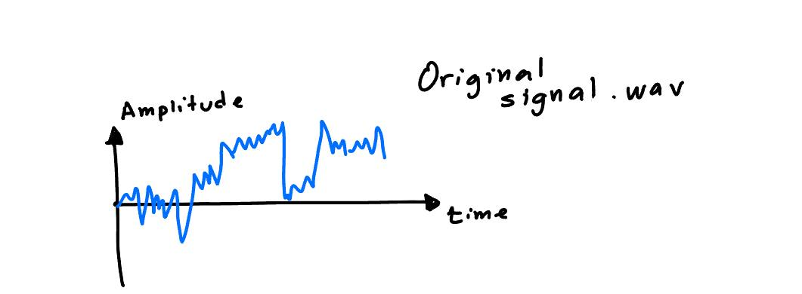
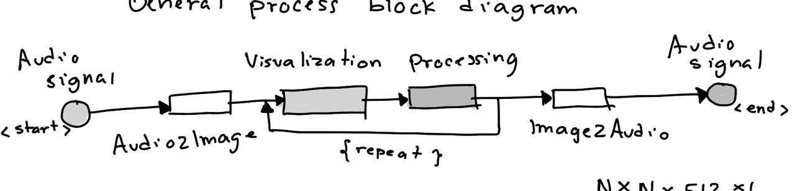
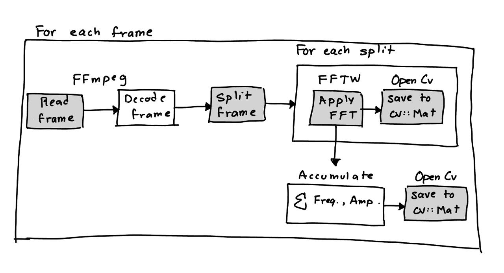
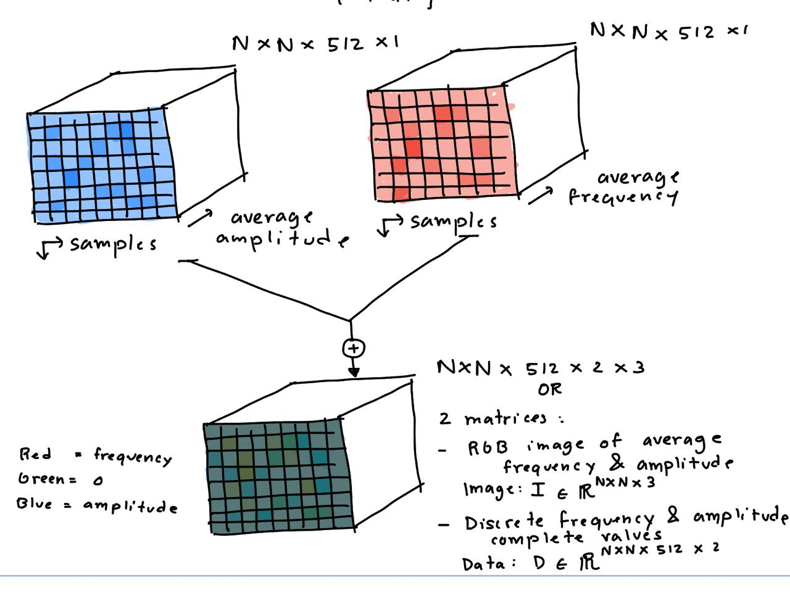
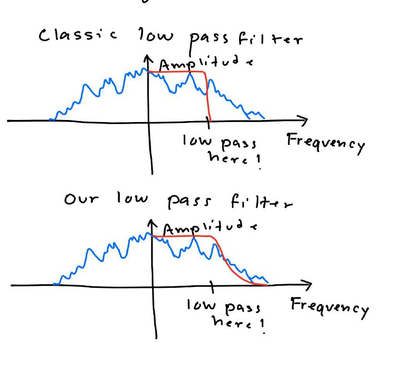
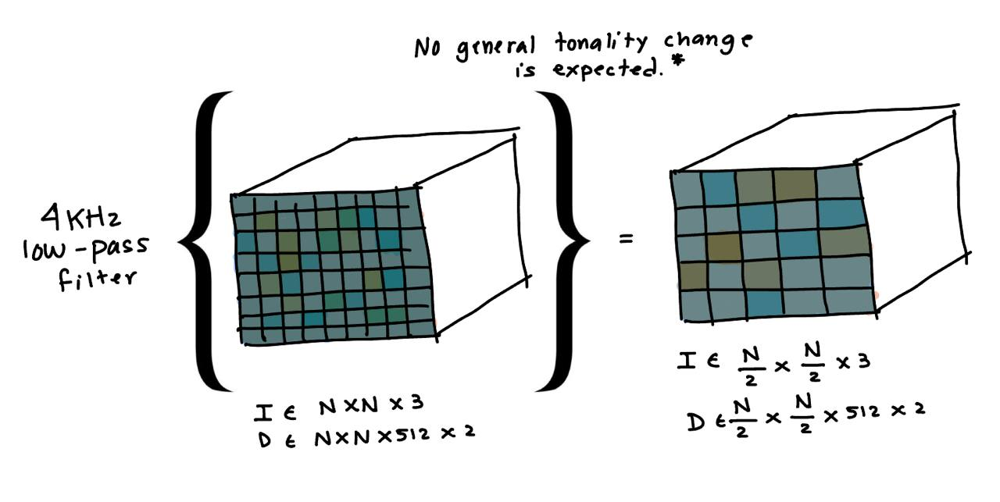
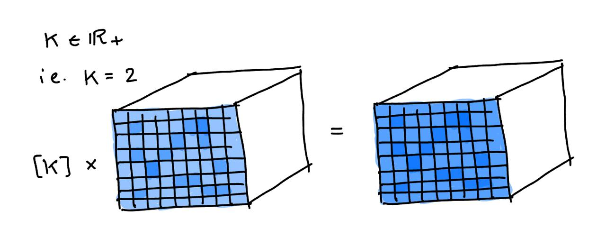
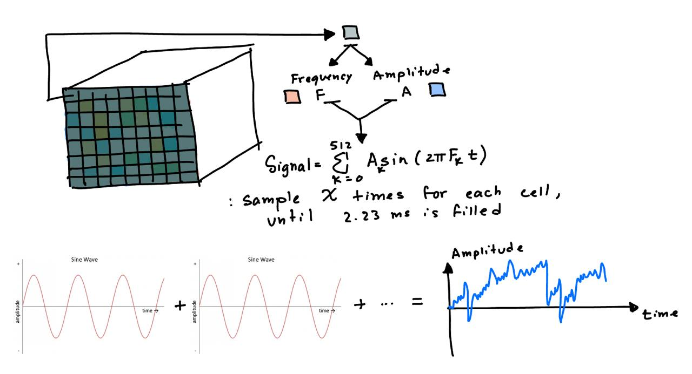

# AudioVisual-toolbox

A toolbox for processing audio signals from uncompressed CD audio formats like `.WAV`, `.FLAC` or `.AIFF`, in a highly visual, simple and intuitive way. All the toolbox is programmed in C++ to keep it fast, efficient, and by consequence, usable and useful.

It provides the ability to apply filters like band filters or volume scaling with binary or smooth effect on the signal. The system can operate in *high-fidelity* mode, where it keeps track of a pair of matrices I:image and D:data, and avoids big losses in frequency information, or it can operate in *low-fidelity* mode, where it only keeps track of the I:image matrix and performs all the operations with this matrix.

May be configured to work with files at 44.1 KHz, 48 KHz or 96 KHz sampling frequencies.

## How it works

This toolbox leverages FFmpeg, OpenCV and FFTW3 libraries for managing audio files, matrix/image operations and visualization, and Fast Fourier Transform calculation, respectively.

### General process block diagram

<p align="center">
  
</p>

Consider an original signal in an example format like `.WAV`. The tool works in 3 general steps, encoding to image, filtering, and decoding to audio. See the following diagram to understand the process:

<p align="center">
  
</p>

The **Audio2Image** step has the following inner logic:

<p align="center">
  
</p>

The creation of an image from an audio signal starts by FFmpeg reading the multiple frames into which the complete audio signal is divided into. The size of the frame is set to 1024 samples and at 44.1 KHz represents roughly 2.23 ms time. After retrieval, the frame is decoded and split into two halves. Subsequently, a FFT is applied using FFTW3 to each of the splits, saving the vector of resulting frequencies and amplitudes in a separate matrix in the corresponding "cell". At the same time, the frequencies and amplitudes are transferred to an operation that will average each and save the result into an OpenCV matrix/image with RGB format. Here, color blue is used to represent average amplitude for each time segment, red is used for average frequency, and green remains unused.

<p align="center">
  
</p>

The final image with which the user can work with is the visualization of the aforementioned RGB image. The image is expected to have a purple and grey average hue, with cells varying in redness and blueness.

## Filtering

The process of choosing and evaluating which filter to apply to the image/audio is very intuitive once some properties/qualities about the image are well understood. Note that the song/time progresses left to right and top to bottom. Here are some observations that should help understand some of the observable qualities of this visual audio representation:

1. Low frequency oscillations and other harmonics generally show as a gradient in one or more rows.
2. More saturated purple color generally means higher volume/amplitude and frequency.
3. Frequencies are contained inside the data matrix, as an average in the image, and embedded into the sequence of cells itself and the time delta that each cell covers.
4. Harmonics and low frequency oscillations will likely be visible up-down and side-to-side. They will show as the hue of the cells changing from some value to another and maybe going back (if the oscillation repeats).

### Low-pass, high-pass, band-pass filter

One of the nice things about of this two matrix representation is that you can play with band filters with more liberty without increasing planning complexity for the user. A filter can be both applied as a "binary cut", where 100% or 0% of the values for some frequencies specified by a band, or by some value between 0.0-1.0, resulting in the cut being progressive with a logarithmic-like cut edge. This is what it could look like:

<p align="center">
  
</p>

The following image is meant to illustrate how a low-pass filter for the *low-fidelity* mode can be represented as a change in dimensionality of the image matrix. The operation for a frequency F > 2.23 kHz will result in merging or taking the median of the frequency average value of neighboring cells. 

This is achieved by applying a kernel of size N × 1, where N is determined as the best approximation to the desired cutoff frequency. Specifically, N is chosen as a multiple of the base cell frequency:

<p align="center">
  
</p>

### Volume scaling filter

This repository refers to a volume scaling filter to that which only affects the amplitude of the signal. The volume scaling can be applied to the whole signal or to fraction of the signal by specifying start and end times (and the tool will approximate to the closest cell available) or start and end cells.

<p align="center">
  
</p>


## Image2Audio

For *low-fidelity* mode, the conversion from the image to the audio does not require the extra data matrix with the specific frequency components. The conversion is done by retrieving the average frequency and amplitude values for each of the segments, passing them through a sinusoidal function to generate time domain signal samples, and joining all the samples together in order. The function is as follows:

```math
s[n] = \sum_{K=0}^{N} A_K \sin(2\pi F_K n), \quad n = 0, 1, 2, \dots, 512
```
Where:
```math
\begin{align*}
A_K &= \text{average amplitude for segment } K \\
F_K &= \text{average frequency for segment } K \\
N &= \text{total number of segments}
\end{align*}
```
This is a graphic representation of this operation:
> NOTE ignore the summation in the image, as it only represents appending the signal samples and not adding them up.

<p align="center">
  
</p>
